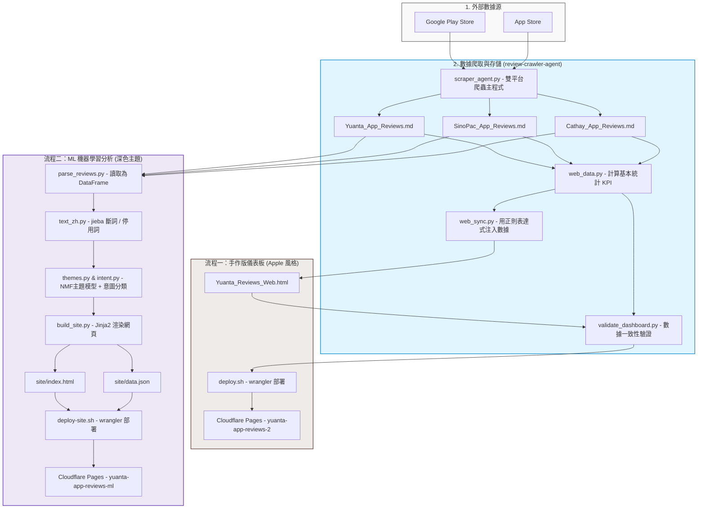

# 券商 App 輿情監測與分析平台 (Yuanta App Reviews 2.0)

本專案旨在抓取並分析台灣三大券商 App（**元大投資先生**、**永豐大戶投**、**國泰證券**）於 App Store 與 Google Play 上的用戶評論，提供多維度的輿情數據監測與競品分析。

專案目前包含**兩套獨立且平行運作的儀表板系統**，分別滿足不同場景的呈現與數據分析需求。

---

## 📁 目錄結構

```text
輿論平台/
├── 📄 README.md                       # 本說明文件
├── 📄 Yuanta_Reviews_Web.html        # 【手作版】前端網頁 (Apple 設計風格)
├── 📄 deploy.sh                       # 【手作版】部署至 Cloudflare Pages 腳本
├── 📄 deploy-site.sh                  # 【ML版】部署至 Cloudflare Pages 腳本
├── 📄 *_App_Reviews.md                # 爬蟲爬回來的原始數據 (Markdown 表格)
│
├── 📁 review-crawler-agent/           # 數據爬蟲與自動化同步模組
│   ├── scraper_agent.py               # 雙平台爬蟲主程式
│   ├── web_data.py                    # 解析原始 md 並計算統計數據的程式
│   ├── web_sync.py                    # 將新數據同步至手作版 HTML 的正則替換程式
│   ├── validate_dashboard.py          # 驗證網頁指標與原始數據一致性的防呆程式
│   └── requirements.txt               # 爬蟲依賴套件
│
├── 📁 analysis/                       # NLP 與 機器學習分析模組
│   ├── parse_reviews.py               # 解析原始 md 檔轉為 DataFrame
│   ├── text_zh.py                     # 中文斷詞與停用詞過濾 (jieba)
│   ├── themes.py                      # TF-IDF + NMF 主題模型分析
│   ├── intent.py                      # 弱監督意圖分類模型 (Logistic Regression)
│   ├── build_site.py                  # 執行分析並渲染新版網頁的主入口
│   ├── templates/                     # 網頁 Jinja2 模板
│   └── requirements.txt               # 分析管線依賴套件
│
└── 📁 site/                           # 【ML版】輸出目錄
    ├── index.html                     # 自動生成的新版分析儀表板 (深色主題)
    └── data.json                      # 結構化輿情分析 JSON 數據
```

---

## 🛠️ 環境建置 (Setup)

本專案主要使用 Python 進行資料抓取與分析。請先建立虛擬環境並安裝所需套件：

```bash
# 1. 建立虛擬環境
python -m venv .venv

# 2. 啟動虛擬環境 (Windows PowerShell)
.venv\Scripts\Activate.ps1
# (如果是 macOS/Linux: source .venv/bin/activate)

# 3. 安裝依賴套件
pip install -r review-crawler-agent/requirements.txt -r analysis/requirements.txt
```

---

## 🔄 兩套操作流程說明

本專案包含兩套獨立運作的儀表板與流程，以下為**整體資料流與架構圖**：



本專案有兩套不同的開發與同步流程，您可以根據需求進行對應的操作：

### 流程一：手作版儀表板流程 (Apple 設計風格)
* **適用場景**：調整主視覺、前端排版、更新基本統計 KPI 與手選精選評論。
* **核心檔案**：[Yuanta_Reviews_Web.html](file:///d:/Desktop/輿論平台/Yuanta_Reviews_Web.html)
* **操作流程**：
  ```mermaid
  graph TD
      A["爬蟲抓取資料"] -->|1. scraper_agent.py| B["更新原始 *_App_Reviews.md"]
      B -->|2. web_sync.py| C["自動注入數據至 Yuanta_Reviews_Web.html"]
      C -->|3. validate_dashboard.py| D["數據防呆驗證"]
      D -->|4. deploy.sh| E["部署至 Pages (yuanta-app-reviews-2)"]
  ```
  1. **手動更新與同步數據**：
     ```bash
     # 抓取最新評論
     python review-crawler-agent/scraper_agent.py --run-now
     # 同步數據至 HTML
     python review-crawler-agent/web_sync.py
     ```
  2. **數據防呆驗證**（確認注入的數據無 divergence）：
     ```bash
     python review-crawler-agent/validate_dashboard.py
     ```
  3. **部署**：
     ```bash
     ./deploy.sh
     ```

---

### 流程二：ML 機器學習分析儀表板流程 (深色主題)
* **適用場景**：修改中文詞庫、調整機器學習模型（主題分類、意圖識別參數）、修改深色儀表板版面。
* **核心檔案**：[site/index.html](file:///d:/Desktop/輿論平台/site/index.html) (透過 `analysis/templates/` 模板生成)
* **操作流程**：
  ```mermaid
  graph TD
      A["修改分詞/模型/HTML模板"] -->|1. build_site.py| B["重新計算並渲染"]
      B -->|產生最新| C["site/data.json & site/index.html"]
      C -->|2. deploy-site.sh| D["部署至 Pages (yuanta-app-reviews-ml)"]
  ```
  1. **調整模型或語意規則**：
     * 修改詞庫：[analysis/userdict_zh.txt](file:///d:/Desktop/輿論平台/analysis/userdict_zh.txt) 或 [analysis/stopwords_zh.txt](file:///d:/Desktop/輿論平台/analysis/stopwords_zh.txt)
     * 修改版面：調整 `analysis/templates/` 內的 HTML/CSS
  2. **重跑分析管線並建置**：
     ```bash
     cd analysis
     python build_site.py --fresh
     ```
  3. **部署**：
     ```bash
     cd ..
     ./deploy-site.sh
     ```

---

## ⚠️ 注意事項與開發 Gotchas

1. **避免手動修改網頁上的數字**：
   * `Yuanta_Reviews_Web.html` 內的多數 KPI 數字會被 `web_sync.py` 自動覆寫。
   * `site/index.html` 的內容完全是由 `analysis/build_site.py` 重新編譯產生的。
   * 若要變更數據或結構，請修改對應的同步/分析腳本或 Jinja2 模板。
2. **斷詞與主題調整**：
   * 主題是透過 NMF 非監督式演算法抽取。若分類不夠精準，請優先調整分詞自訂詞庫 `userdict_zh.txt` 或在 `analysis/themes.py` 中調整主題數量 `N_THEMES`。
