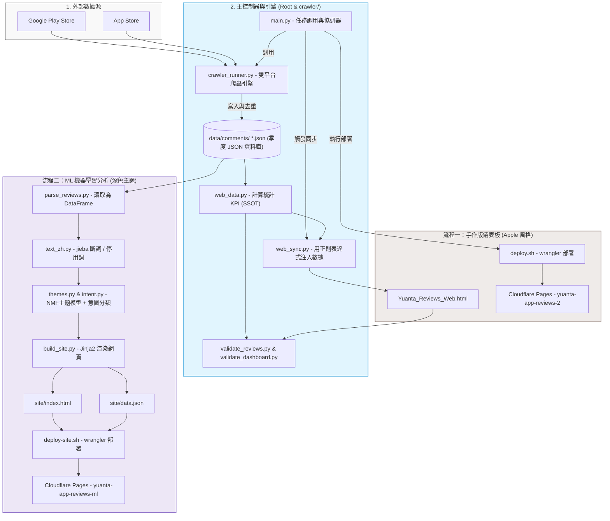

# 券商 App 輿情監測與分析平台 (Yuanta App Reviews 2.0)

本專案旨在抓取並分析台灣三大券商 App（**元大投資先生**、**永豐大戶投**、**國泰證券**）於 App Store 與 Google Play 上的用戶評論，提供多維度的輿情數據監測與競品分析。

專案目前包含**兩套獨立且平行運作的儀表板系統**，分別滿足不同場景的呈現與數據分析需求。

---

## 目錄結構

```text
輿論平台/
├── 📄 README.md                       # 本說明文件
├── 📄 main.py                         # 統一任務調用與協調器 (入口程式)
├── 📄 Yuanta_Reviews_Web.html        # 【手作版】前端網頁 (Apple 設計風格)
├── 📄 deploy.sh                       # 【手作版】部署至 Cloudflare Pages 腳本
├── 📄 deploy-site.sh                  # 【ML版】部署至 Cloudflare Pages 腳本
│
├── 📁 data/                           # 原始評論資料庫
│   └── 📁 comments/                   # 按季度劃分的 PEP8 JSON 檔案路徑
│       ├── yuanta_2026_q1.json        # 元大 2026 第一季評論
│       ├── yuanta_2026_q2.json        # 元大 2026 第二季評論
│       └── ...                        # （永豐大戶投、國泰證券依此類推）
│
├── 📁 crawler/                        # 數據爬蟲與資料庫引擎套件
│   ├── crawler_runner.py              # 雙平台爬蟲核心引擎 (純 Engine Library)
│   ├── web_data.py                    # 載入 JSON 資料庫並計算統計指標 (SSOT)
│   ├── web_sync.py                    # 將新數據同步至手作版 HTML 的正則替換程式
│   ├── validate_reviews.py            # 資料庫去重校驗防呆程式
│   ├── validate_dashboard.py          # 驗證網頁指標與資料庫一致性的校驗程式
│   ├── run_crawler.sh                 # 呼叫 main.py 執行的一鍵啟動腳本
│   └── requirements.txt               # 爬蟲與引擎依賴套件
│
├── 📁 analysis/                       # NLP 與 機器學習分析模組
│   ├── parse_reviews.py               # 解析 JSON 資料庫轉為 DataFrame
│   ├── text_zh.py                     # 中文斷詞與停用詞過濾 (jieba)
│   ├── themes.py                      # TF-IDF + NMF 主題模型分析
│   ├── intent.py                      # 弱監督意圖分類模型 (Logistic Regression)
│   ├── build_site.py                  # 執行分析並渲染新版網頁的主入口
│   ├── templates/                     # 網頁 Jinja2 模板
│   └── requirements.txt               # 分析管線依賴套件
│
└── 📁 site/                           # 【ML版】輸出目錄
    ├── index.html                     # 自動生成的新版分析儀表板 (深色主題)
    └── data.json                      # 結構化輿情分析 JSON 數據
```

---

## 環境建置 (Setup)

本專案主要使用 Python 進行資料抓取與分析。請先建立虛擬環境並安裝所需套件：

```bash
# 1. 建立虛擬環境
python -m venv .venv

# 2. 啟動虛擬環境 (Windows PowerShell)
.venv\Scripts\Activate.ps1
# (如果是 macOS/Linux: source .venv/bin/activate)

# 3. 安裝依賴套件
pip install -r crawler/requirements.txt -r analysis/requirements.txt
```

---

## 整體資料流與架構說明

專案採用「單一入口、引擎分離」架構，以下為**整體資料流與架構圖**：



---

## 爬取、寫入與同步技術指南

### 1. 爬取目標與來源網站
系統主要從以下兩個管道獲取最新評論：
*   **Google Play Store (Android)**
    *   檔案：crawler/gplay_scraper.py
    *   技術手段：使用第三方庫 `google-play-scraper`，對 Google 官方的 Play Store API 端點進行封裝請求。
    *   主要獲取：評論者姓名、發布時間、版本號、星等、標題與內文，以及客服人員的回覆內容。
*   **App Store (iOS)**
    *   檔案：crawler/appstore_scraper.py
    *   技術手段：採取三合一混合抓取模式以確保資料即時度與完整性：
        1.  **網頁 HTML 解析**：請求網頁 `https://apps.apple.com/tw/app/id{app_id}?see-all=reviews`，並從 `serialized-server-data` 腳本標籤提取結構化資料。
        2.  **Apple Catalog API (amp-api)**：使用從 HTML 中提取的 Bearer Token，直接發送 API 請求以獲取最即時的資料。
        3.  **iTunes RSS 訂閱源**：透過 `https://itunes.apple.com/tw/rss/customerreviews/page={page}/id={app_id}/sortBy=mostRecent/json` 接口獲取歷史評論。

### 2. 爬取數量控制與設定
*   **預設抓取數量**：在 [[crawler/config.py](file:///g:/我的雲端硬碟/專案/輿論平台/crawler/config.py)] 中預設 `FETCH_COUNT = 100`（即 Google Play 與 App Store 兩平台各抓取最新 100 筆）。
*   **動態覆寫數量**：執行 `python main.py` 時可使用參數 `--count N`（例如 `--count 10`）來動態設定抓取上限。

### 3. 程式間函數呼叫流程 (Function Call Flow)
當執行完整更新時，系統內部會按以下順序調用函數：
1.  **進入控制主入口**：[[main.py](file:///g:/我的雲端硬碟/專案/輿論平台/main.py)] 的 `main()` 解析 CLI 參數後，呼叫 `run_crawler(fetch_count)`。
2.  **調用爬蟲協調引擎**：`run_crawler()` 讀取設定檔中的 App 清單，並在迴圈中對每個 App 呼叫 [[crawler/crawler_runner.py](file:///g:/我的雲端硬碟/專案/輿論平台/crawler/crawler_runner.py)] 的 `process_app(app, fetch_count)`。
3.  **爬取雙平台資料**：
    *   `process_app()` 首先嘗試透過 `resolve_appstore_id(app)` 獲取/偵測 App Store ID。
    *   呼叫 [[crawler/gplay_scraper.py](file:///g:/我的雲端硬碟/專案/輿論平台/crawler/gplay_scraper.py)] 的 `fetch_reviews(...)` 取得 Android 評論物件列表。
    *   呼叫 [[crawler/appstore_scraper.py](file:///g:/我的雲端硬碟/專案/輿論平台/crawler/appstore_scraper.py)] 的 `fetch_reviews(...)` 與 `fetch_developer_replies(...)` 取得 iOS 評論以及開發者回覆。
4.  **去重並寫入 JSON 資料庫**：
    *   `process_app()` 呼叫 `crawler_runner.py` 的 `update_database(...)`。
    *   `update_database()` 呼叫 `get_existing_reviews(short_name)` 載入 `data/comments/` 下該 App 的所有歷史 JSON。
    *   透過評論指紋 `dedup_key` 與 `content_dedup_key` 進行去重過濾，僅將新評論以季度格式（呼叫 `get_quarter_filename` 計算檔名）儲存並覆寫對應的 JSON 檔案。
    *   針對 App Store 評論，呼叫 `backfill_appstore_replies(...)` 回填歷史評論的客服回覆內容。

### 4. JSON 評論資料庫格式
每個產出的 JSON 檔案（存放在 `data/comments/{short_name}_{year}_q{quarter}.json`）結構為一個包含多個評論物件的陣列，具體欄位格式如下：
```json
[
  {
    "platform": "Google Play",
    "date": "2026-07-21T08:32:54+08:00",
    "username": "用戶名稱",
    "rating": 5,
    "version": "1.4.3",
    "title": "評論標題",
    "content": "評論詳細內容",
    "raw_id": "gp:123456789",
    "reply_content": "客服人員回覆內容",
    "reply_date": "2026-07-21T09:00:00+08:00"
  }
]
```

### 5. 同步寫入 HTML 的具體位置與機制
同步程式 crawler/web_sync.py 執行時，會讀取所有季度 JSON 資料，並使用 Python 的正則表達式（re.sub）直接對 `Yuanta_Reviews_Web.html` 進行原地替換，寫入以下區域：
*   **全量評論數據陣列**：`const allReviews = [...];` 的 JavaScript 全域變數中，提供網頁端「評論瀏覽器」分頁與關鍵字篩選表格 of 數據來源。
*   **Chart.js 圖表數據集**：網頁中繪製圖表所需的 JavaScript `data` 屬性陣列，涵蓋 `yuantaStarChart`（星等分佈對比）、`brandCompareChart`（三大品牌季度評分平均對比）、`donutChart`（元大平台評論比例）。
*   **關鍵 KPI 指標數值**：如 `<div class="mn">總評論數</div>`、`Q2 均分`、`Q2 低分率` 的 DOM 節點中。
*   **券商指標卡片與趨勢標記**：各品牌展示卡片區塊，包含代表趨勢升降的 CSS 類名（`du` 或 `dd`）、變動幅度（`+0.15 ★`）以及進度條的寬度百分比（`width: 85.0%`）。
*   **洞察段落的內文數據**：如 `<b class="by">4.25★</b>` 等嵌入於行文中的加粗數據標籤，確保報告解說文字與最新資料庫數字一致。

### 6. 數據安全與防錯機制 (五大關卡)
當執行完整更新（`python main.py --run-now`）時，系統會按順序通過以下關卡防錯：
1.  **抓取更新**：執行爬蟲引擎，並根據舊有記錄作 UUID/內容雙重去重，僅增量寫入 JSON。
2.  **同步網頁**：讀取所有 JSON，計算評分平均與 KPI 後寫入 `Yuanta_Reviews_Web.html` 的 Chart 陣列中。
3.  **儀表板驗證**：利用 `validate_dashboard` 反解析 HTML 中的 Chart 資料與數值，與 JSON 計算出的結果比對，確保數據無誤。
4.  **去重驗證**：掃描所有 JSON 評論庫，確認無重複發表的評論（允許相同用戶在不同日期發表同內容）。
5.  **部署上線**：在通過上述所有校驗後，才觸發 `deploy.sh` 部署上線。若中途任何一關失敗，會立即中止並透過通知系統發送錯誤警報。

---

## 雙套儀表板開發與同步流程

### 流程一：手作版儀表板流程 (Apple 設計風格)
* **適用場景**：調整主視覺、前端排版、更新基本統計 KPI 與手選精選評論。
* **核心檔案**：[Yuanta_Reviews_Web.html](file:///g:/%E6%88%91%E7%9A%84%E9%9B%B2%E7%AB%AF%E7%A1%AC%E7%A2%9F/%E5%B0%88%E6%A1%88/%E8%BC%BF%E8%AB%96%E5%B9%B3%E5%8F%B0/Yuanta_Reviews_Web.html)

#### 1. 使用主控制器執行完整或自訂工作流：
```bash
# 執行完整工作流 (抓取 -> 同步 -> 校驗 -> 部署)
python main.py --run-now

# 自訂抓取數量執行完整工作流
python main.py --run-now --count 5

# 啟動定時排程模式（背景持續運行，預設每週一 09:00）
python main.py --schedule
```

#### 2. 自訂模組獨立測試（Debug 用）：
```bash
# 僅進行評論抓取與資料更新
python main.py --crawler --count 5

# 僅執行統計數據同步至網頁儀表板
python main.py --sync

# 僅執行資料庫去重校驗
python main.py --validate

# 僅執行網頁部署
python main.py --deploy
```

#### 3. 測試 App Store ID 自動偵測：
```bash
python main.py --find-ids
```

---

### 流程二：ML 機器學習分析儀表板流程 (深色主題)
* **適用場景**：修改中文詞庫、調整機器學習模型（主題分類、意圖識別參數）、修改深色儀表板版面。
* **核心檔案**：[site/index.html](file:///g:/%E6%88%91%E7%9A%84%E9%9B%B2%E7%AB%AF%E7%A1%AC%E7%A2%9F/%E5%B0%88%E6%A1%88/%E8%BC%BF%E8%AB%96%E5%B9%B3%E5%8F%B0/site/index.html) (透過 `analysis/templates/` 模板生成)
* **操作流程**：
  1. **調整模型或語意規則**：
     * 修改詞庫：analysis/userdict_zh.txt 或 analysis/stopwords_zh.txt
     * 修改版面：調整 `analysis/templates/` 內的 HTML/CSS
  2. **重跑分析管線並建置**：
     ```bash
     cd analysis
     python build_site.py
     ```
  3. **手動發布部署**：
     ```bash
     cd ..
     ./deploy-site.sh
     ```

---

## 注意事項與開發 Gotchas

1. **避免手動修改網頁上的數字**：
   * `Yuanta_Reviews_Web.html` 內的多數 KPI 數字會被 `web_sync.py` 自動覆寫。
   * `site/index.html` 的內容完全是由 `analysis/build_site.py` 重新編譯產生的。
   * 若要變更數據或結構，請修改對應的同步/分析腳本或 Jinja2 模板。
2. **斷詞與主題調整**：
   * 主題是透過 NMF 非監督式演算法抽取。若分類不夠精準，請優先調整分詞自訂詞庫 `userdict_zh.txt` 或在 `analysis/themes.py` 中調整主題數量 `N_THEMES`。
3. **時區與去重校驗說明**：
   * 評論資料庫全部採用 ISO 8601 時區表示（預設為台北時區 UTC+8）。
   * `validate_reviews.py` 校驗會以「平台、用戶名稱、評分、內文、發佈日期(YYYY-MM-DD)」作為唯一鍵進行重複資料檢測，容許用戶在不同日期提交相同反饋，但可防止同天抓取漂移產生的重複。
